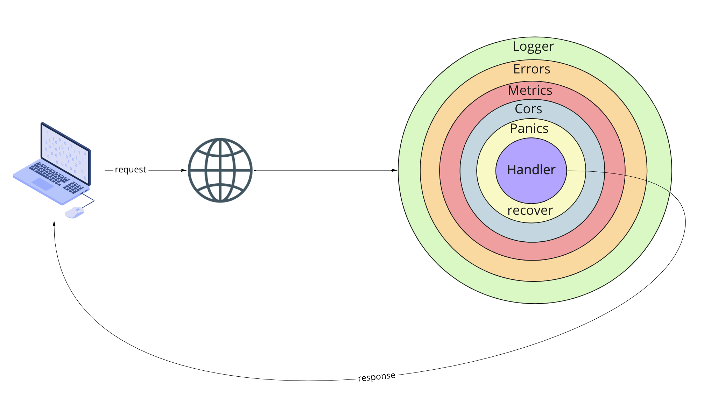

# gen-core

## workflow


## Docker

### docker provides support for starting and stopping docker containers for running tests.

container struct
```go
// Container tracks information about the docker container started for tests.
type Container struct {
	ID   string
	Host string // IP:Port
}
```

#### Extract IP Port docker container with 'Format command and log output' of Docker using Go template
[doc](https://docs.docker.com/config/formatting/)

```go
tmpl := fmt.Sprintf("[{{range $k,$v := (index .NetworkSettings.Ports \"%s/tcp\")}}{{json $v}}{{end}}]", port)

cmd := exec.Command("docker", "inspect", "-f", tmpl, id)
var out bytes.Buffer
cmd.Stdout = &out
if err := cmd.Run(); err != nil {
	// handle err
}
```

## Keystore
structure


